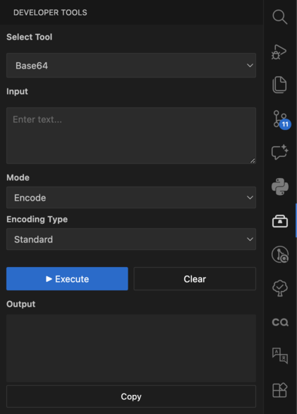

# Developer Tools

A VS Code sidebar extension with developer utilities including encoding/decoding, generators, hash tools, JSON path/validation, text manipulation, color picker, timestamp conversion, unit converters, code/SQL formatters, regex tester, and certificate analyzer.

## Features

- **Encoding** - Base64, Base32, URL, JWT
- **Generators** - UUID, ULID, NanoID, Password, Lorem Ipsum, QR/Barcode
- **Hash** - MD5, SHA-1/256/512, HMAC
- **JSON** - JSONPath queries, schema validation, format conversion
- **Text** - Case conversion, sort, filter, escape, format converter
- **Color** - Interactive color picker with HEX/RGB/HSL
- **Date/Time** - Timestamp converter
- **Units** - Data, time, transfer rate, temperature, length
- **Format** - Code, SQL, and data formatters
- **Advanced** - Regex tester, certificate analyzer

## Requirements

VS Code 1.107.0 or higher

## Release Notes

### 1.0.0

Initial release

### 1.0.2

- Reorganized dropdown
- Adapted icon
